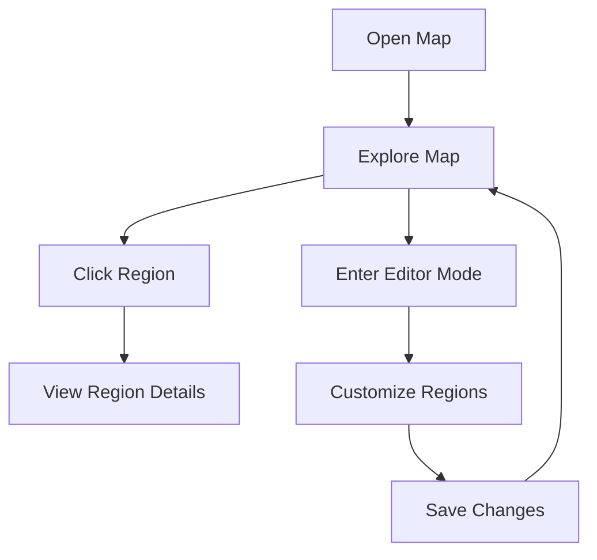

## 1. Product Overview
现代风开放世界RPG游戏地图，提供精致的视觉体验和交互式探索功能。
- 为游戏开发者和玩家提供直观的地图导航和区域探索工具
- 目标是成为游戏开发中地图设计的标准参考工具

## 2. Core Features

### 2.1 User Roles (if applicable)
| Role | Registration Method | Core Permissions |
|------|---------------------|------------------|
| Player | No registration required | Browse map, explore regions, view points of interest |
| Developer | No registration required | Access map editor, customize regions |

### 2.2 Feature Module
1. **Map View**: Interactive map with zoom, pan, and region selection
2. **Region Details**: Information about selected regions, including points of interest
3. **Map Editor**: Tools for customizing and creating map regions

### 2.3 Page Details
| Page Name | Module Name | Feature description |
|-----------|-------------|---------------------|
| Map View | Interactive Map | Zoom in/out, pan across map, click on regions for details, display terrain types and points of interest |
| Map View | Region Details | Show name, description, level range, available quests, and notable landmarks for selected region |
| Map Editor | Region Creator | Add new regions, define boundaries, set terrain types, and place points of interest |
| Map Editor | Terrain Customizer | Adjust terrain features, add environmental effects, and set region properties |

## 3. Core Process
User opens the map → Explores different regions by zooming and panning → Clicks on regions to view details → Optionally enters editor mode to customize map

## 4. User Interface Design
### 4.1 Design Style
- Primary colors: #1a1a2e, #16213e, #0f3460
- Secondary colors: #e94560, #00b894, #feca57
- Button style: Rounded with subtle glow effect
- Font: Orbitron (sans-serif) for headings, Roboto for body text
- Layout style: Dark theme with neon accents, card-based information display
- Icon style: Futuristic, geometric icons with subtle animations

### 4.2 Page Design Overview
| Page Name | Module Name | UI Elements |
|-----------|-------------|-------------|
| Map View | Interactive Map | Dark background with neon borders for regions, dynamic lighting effects, smooth zoom/pan animations, floating icons for points of interest |
| Map View | Region Details | Card with glass-morphism effect, neon border, animated background, scrollable content with quest and landmark information |
| Map Editor | Region Creator | Sidebar with tools, color picker for terrain types, drag-and-drop interface for placing points of interest, real-time preview |
| Map Editor | Terrain Customizer | Sliders for terrain properties, preview window with environmental effects, layer management system |

### 4.3 Responsiveness
- Desktop-first design with mobile-adaptive layout
- Touch optimization for mobile devices, including pinch-to-zoom and swipe-to-pan
- Collapsible sidebar for smaller screens
- Responsive font sizes and UI elements

### 4.4 3D Scene Guidance (if applicable)
- Environment/HDRI: Urban cyberpunk city with neon lights and fog
- Lighting setup: Dynamic point lights for neon signs, ambient occlusion for depth
- Camera settings: Isometric view with smooth rotation and zoom
- Composition: Focus on key landmarks and points of interest
- Interactions: Hover effects for regions, click animations for selection
- Post-processing effects: Bloom for neon lights, depth of field for focus
- Asset sources: Custom 3D models for landmarks, procedural terrain generation
- Performance budgets: Optimized for 60fps on mid-range devices