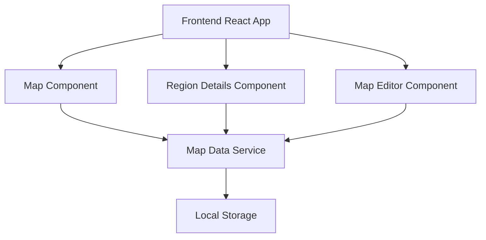
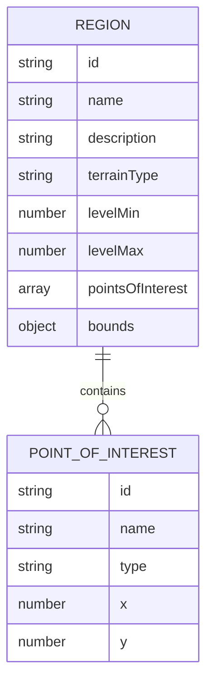

## 1. Architecture Design


## 2. Technology Description
- Frontend: React@18 + tailwindcss@3 + vite
- Initialization Tool: vite-init
- Backend: None (local storage for data persistence)
- Database: Local Storage (for saving map customizations)

## 3. Route Definitions
| Route | Purpose |
|-------|---------|
| / | Main map view with interactive exploration |
| /editor | Map editor for customizing regions |

## 4. API Definitions (if backend exists)
Not applicable - using local storage for data persistence

## 5. Server Architecture Diagram (if backend exists)
Not applicable - no backend server

## 6. Data Model (if applicable)
### 6.1 Data Model Definition


### 6.2 Data Definition Language
```javascript
// Region data structure
const region = {
  id: "unique-id",
  name: "Cyber District",
  description: "A bustling urban area with neon lights and futuristic architecture",
  terrainType: "urban",
  levelMin: 1,
  levelMax: 10,
  pointsOfInterest: [
    {
      id: "poi-1",
      name: "Neon Market",
      type: "market",
      x: 100,
      y: 150
    },
    {
      id: "poi-2",
      name: "Tech Tower",
      type: "landmark",
      x: 200,
      y: 100
    }
  ],
  bounds: {
    x1: 50,
    y1: 50,
    x2: 250,
    y2: 250
  }
};

// Map data structure
const mapData = {
  regions: [region1, region2, ...],
  settings: {
    backgroundColor: "#1a1a2e",
    gridEnabled: true,
    zoomLevel: 1
  }
};
```